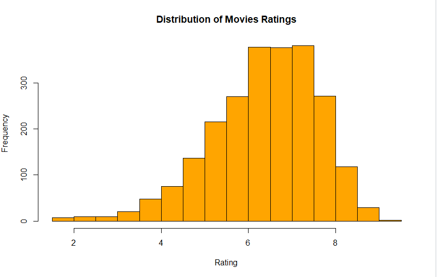
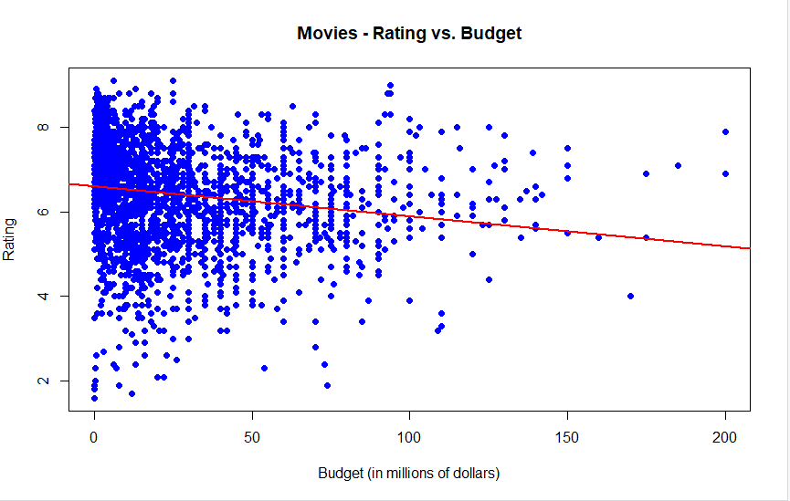
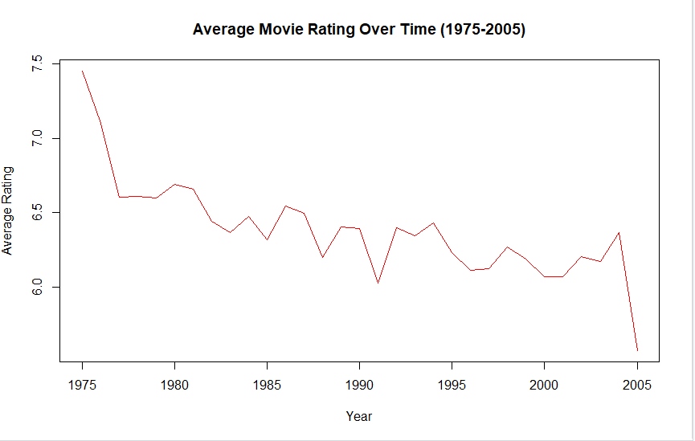

# Analysis of the Relationships Between Movie Characteristics and Their Ratings Using R

## Overview
This Script analyzes the relationship between **movie characteristics** and **user ratings** using the **ggplot2movies dataset** in R. The dataset contains information about movies, including **title, release year, budget, runtime, IMDb rating, and genre classifications**. The objective of this analysis is to explore trends and patterns in ratings based on these characteristics.

## Data Preparation
The dataset was cleaned and preprocessed as follows:
- Selected relevant variables: **title, rating, budget, votes, length, year, Action**.
- Filtered movies with **at least 1000 votes** to ensure reliability.
- Removed missing values.
- Converted units:
  - **Runtime** changed from **minutes to hours**.
  - **Budget** converted from **dollars to millions**.
- Identified the highest-rated movie and the highest-budget movie.

## Descriptive Analysis
Basic statistics were computed to understand key characteristics of the dataset:
- **Total number of movies analyzed:** `numMovies`
- **Average rating across all movies:** `avgRating`
- **Average budget across all movies:** `avgBudget`
- **Average rating and budget for Action vs. Non-Action movies:**
  - **Action Movies**: Average rating `avgRatingAction`, Average budget `avgBudgetAction`
  - **Non-Action Movies**: Average rating `avgRatingNonAction`, Average budget `avgBudgetNonAction`
  
## Data Visualization

### Distribution of Movie Ratings
This histogram shows the distribution of IMDb user ratings across all movies.

Findings:
- The majority of movies have ratings **between 5 and 8**.
- Very few movies received **extremely low (<3) or extremely high (>9) ratings**.

### Rating vs. Budget
This scatter plot visualizes the relationship between a movie's budget and its IMDb rating.

Findings:
- The data shows **no strong correlation** between budget and rating.
- The **red regression line** suggests a **slightly negative relationship**, meaning **higher-budget movies do not necessarily receive higher ratings**.

### Average Movie Rating Over Time (1975-2005)
This line plot tracks the trend in average movie ratings over time.

Findings:
- **Ratings were higher in the late 1970s**, followed by a slight decline in later decades.
- There is **no clear increasing or decreasing trend after the 1980s**.

## Regression Analysis
A multivariate regression model was applied to **Action movies** to examine how different characteristics influence ratings.

### Regression Model:
- **Dependent Variable:** `rating`
- **Independent Variables:** `year, length, budget`

#### Regression Coefficients:
| Variable | Coefficient | Significance |
|----------|------------|-------------|
| **Year**  | -0.021  | *** (p < 0.01) |
| **Length (hours)** | +1.196  | *** (p < 0.01) |
| **Budget (millions)** | -0.002  | (Not Significant) |

Key Findings:
- **Movie length has the strongest positive impact** on ratings.
- **Year has a slight negative impact**, meaning **older movies tend to have higher ratings**.
- **Budget does not significantly affect ratings**, suggesting that **spending more does not guarantee a better rating**.

The full regression output can be found in [`regressionResults.txt`](regressionResults.txt).

## Predicted Rating for a Hypothetical Action Movie
Using the regression model, we predicted the rating for a hypothetical action movie with:
- **Year:** 2000
- **Length:** 2 hours
- **Budget:** $1M  

**Predicted IMDb Rating:** `6.15`

This result aligns with the general trend that **action movies tend to have an average rating around 6**.

## Insights and Conclusion
The analysis reveals several key insights about **how movie characteristics influence user ratings**:
1. **Movie length is the most significant factor** influencing ratings, with **longer movies generally receiving higher ratings**.
2. **Older movies tend to have slightly higher ratings** compared to newer movies.
3. **Budget does not significantly impact ratings**, indicating that **a higher production budget does not necessarily mean a better movie**.
4. **The overall distribution of movie ratings is centered between 5 and 8**, suggesting that **most movies receive moderate ratings**.
5. **There is no clear trend in rating changes over time**, but ratings were slightly higher in the late 1970s.

This analysis provides valuable insights for filmmakers and production studios about the factors that contribute to a movie’s IMDb rating.
